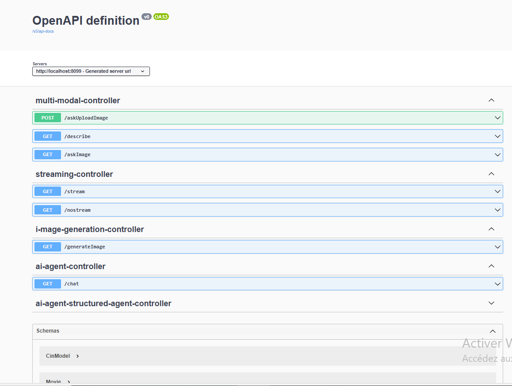

<h1> Generative AI and AI Agents </h1>

projet Spring Boot avec les dépendances Web, JPA, H2, Lombock et Spring AI (Open AI et Ollama)
Création d'un simple chatbot basé sur  les LLMs gpt-4o et llama3.2

<h2>API REST avec Spring AI</h2>

Exemple d'image generee avec Spring AI (/generateImage)

